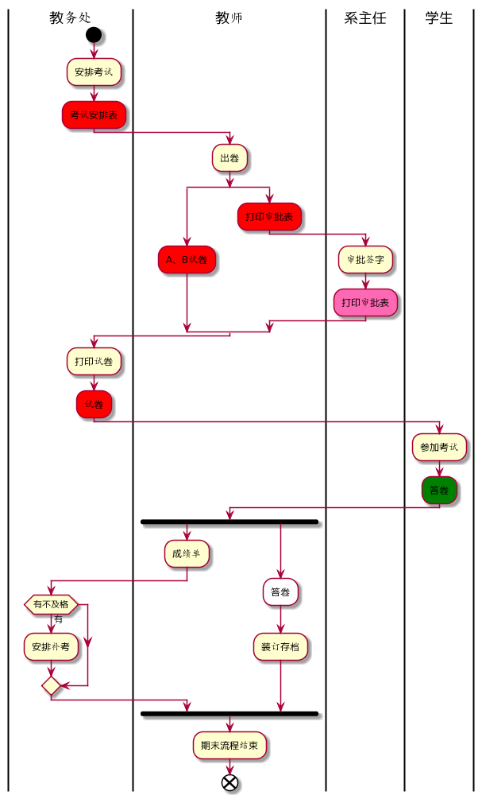
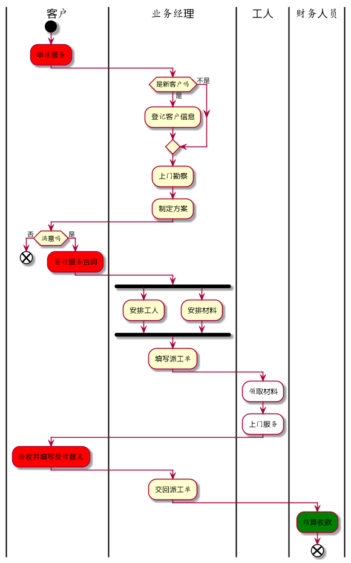

### 姓名：李金辉
### 班级：15软工2班
### 学号：201510414207


- - -
## 流程图1：考试及成绩管理流程
<b>PlantUML源码如下：</b>
```
@startuml
|教务处|
start
:安排考试;
#red:考试安排表;
|教师|
:出卷;
split
#red:A、B试卷;
split again
#red:打印审批表;

|系主任|
:审批签字;
#HotPink:打印审批表;
endsplit
|教务处|
:打印试卷;
#red:试卷;
|学生|
:参加考试;
#green:答卷;
|教师|
fork
    :成绩单;
    |教务处|
    if(有不及格) then(有)
        :安排补考;
     endif
forkagain
|教师|
    #white:答卷;
    :装订存档;
endfork
:期末流程结束;
end

@enduml
```

<b>业务流程图如下：</b>



<b>流程说明：</b>

1. 根据不同的属性权限分成了四列
2. 教务处安排考试给出考试安排表
3. 教师出卷以及给出打印批表
4. 系主任签字，教务处打印试
5. 学生参加考试
6. 教室给出成绩
7. 教务处判断成绩是否及格，并安排补考
8. 期末流程结束


## 流程图2：客户维修服务流程
<b>PlantUML源码如下：</b>
```
@startuml
|客户|
start
    #red:申请服务;
|业务经理|
if(是新客户吗) then(是)
    :登记客户信息;
else(不是)
endif
    :上门勘察;
    :制定方案;
|客户|
if(满意吗) then(否)
    end
else(是)
    #red:签订服务合同;
endif
|业务经理|
fork
    :安排工人;
fork again
    :安排材料;
end fork
    :填写派工单;
|工人|
    #white:领取材料;
    #white:上门服务;
|客户|
    #red:验收并填写反馈意见;
|业务经理|
    :交回派工单;
|财务人员|
    #green:结算收款;
end
@enduml
```


<b>业务流程图如下：</b>



<b>流程说明：</b>
1. 客户申请服务
2. 业务经理判断是否是新客户，并登记客户信息，上门勘察并制定方案
3. 若客户满意，则签订合同
4. 业务经理安排工人和材料，填写派工单
5. 工人领取材料并上门服务
6. 客户验收并反馈
7. 业务经理交回派工单
8. 财务结算收款
