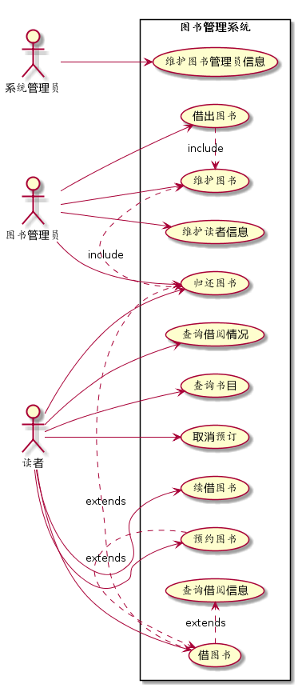
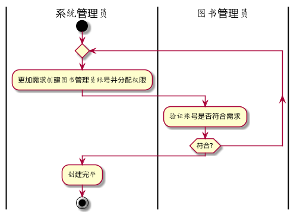
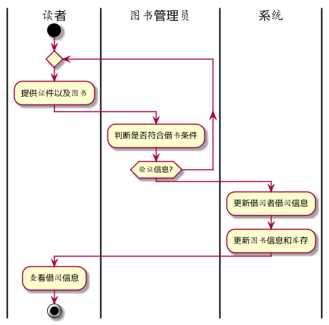

# 实验二：图书管理系统用例建模
### 姓名：李金辉
### 班级：15软工2班
### 学号：201510414207


- - -
# 实验二：图书管理系统用例建模
## 1.图书管理系统的用例关系图
### 1.1用例图PlantUML源码如下：


@startuml
left to right direction
:系统管理员: as SysAdmin
:图书管理员: as Librarian
:读者: as User


rectangle 图书管理系统{
left to right direction

SysAdmin --> (维护图书管理员信息)


User --> (查询借阅情况)
User --> (查询书目)
User --> (预约图书)
User --> (取消预订)
User --> (借图书)
User --> (续借图书)
User --> (归还图书)

Librarian --> (维护图书)
Librarian --> (借出图书)
Librarian --> (归还图书)
Librarian --> (维护读者信息)


(预约图书) .> (借图书) : extends
(借图书) .> (归还图书) : extends
(借图书) .> (查询借阅信息) : extends
(借出图书) .> (维护图书) : include
(归还图书) .> (维护图书) : include

}
@enduml


## 2.参与者说明
### 2.1 系统管理员（SysAdmin）
主要职责是：
- 维护图书管理员的信息，包括图书管理员账号的权限分配，创建，注销。
### 2.2 图书管理员（Librarian）
主要职责是：
- 对读者进行借阅，归还图书操作。
- 更新图书信息。
- 更新读者信息。
### 2.3 读者（User）
主要职责是：
- 可以通查询书籍信息；
- 可以查询自己的借阅信息；
- 可以预约书籍并借阅，也可以取消预约；
## 3.用例规约表
### 3.1 "借出图书"用例
|Title | 内容 |
|:------:|:------:|
|用例名称|借出图书|
|参与者|图书管理员（主要参与者）、借阅者（次要参与者）|
|前置条件|图书管理员确认借阅者所节约的图书信息|
|后置条件|更新图书库存，图书借阅信息更新，借阅者借阅信息更新|
|主事件流|1.借阅者提供相应证件；<br>2.系统验证借阅者身份和图书信息；<br>3.图书管理员将借阅者信息和图书录入系统；<br>4.系统更新借阅者和图书信息；<br>5系统累加读者的借书数量；<br>6.重复3~5，直到图书管理员确认全部图书登记完毕；<br>7.系统打印借书清单，借书完成|

### 3.2 "归还图书"用例
 |Title | 内容 |
 |:------:|:------:|
 |用例名称|还原图书|
 |参与者|图书管理员（主要参与者）、读者（次要参与者）|
 |前置条件|图书管理员已被识别和授权，图书信息确认|
 |后置条件|更新图书信息，读者信息|
 |主事件流|1.读者提供所借图书；<br>2.图书管理员确认图书信息是否完好；<br>3.图书管理员将符合还书条件的图书的信息录入系统；<br>4.更新图书信息和读者信息；<br>5.还书完成 |
 |备注|还书须由图书管理员完成|

### 3.3"图书管理员信息维护"用例
 |Title | 内容 |
 |:------:|:------:|
 |用例名称|图书管理员信息维护|
 |参与者|系统管理员（主要参与者）、图书管理员（次要参与者）|
 |前置条件|系统管理员信息确认|
 |后置条件|更新图书管理员信息|
 |主事件流|1.系统管理员根据业务需求创建新的图书管理员；<br>2.为图书管理员账号分配权限；<br>3.图书管理员确认账号权限；<br>4.创建完成|


### 3.3“图书管理员信息维护”用例流程图源码如下：
 ```

@startuml
|系统管理员|
start
repeat
:更加需求创建图书管理员账号并分配权限;
	|图书管理员|
	:验证账号是否符合需求;
repeat while (符合?)
|系统管理员|
:创建完毕;

stop
@enduml
```
### 3.3“图书管理员信息维护”用例流程图如下：

### 3.4“借出图书”用例流程图源码如下：
 ```
@startuml
|读者|
start
repeat
:提供证件以及图书;
	|图书管理员|
	:判断是否符合借书条件;
repeat while (验证信息?)
|系统|
:更新借阅者借阅信息;
:更新图书信息和库存;
|读者|
:查看借阅信息;

stop
@enduml
```
### 3.4“借出图书”用例流程图如下：


### 3.5“归还图书”用例流程图源码如下：
 ```

@startuml
|读者|
start
:提供证件以及图书;
	|图书管理员|
	:判断是否符合还书条件;
if (验证是否符合约定?) then (yes)
  :顺利还书;
else (no)
  :根据规定处理;
endif
|图书管理员|
:更新借阅者借阅信息;
:更新图书信息和库存;
|读者|
:查看借阅信息;

stop
@enduml
```
### 3.5“归还图书”用例流程图如下：
![]returnbook.png)

