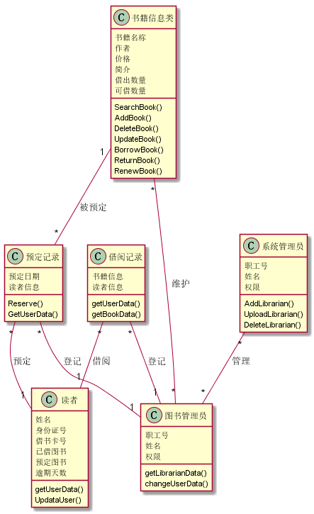
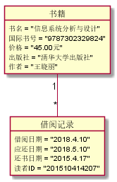
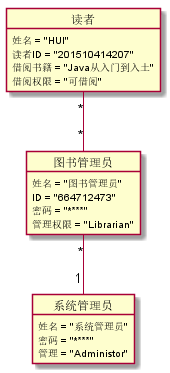

## 实验三：图书管理系统领域对象建模

|学号|班级|姓名|
|:---------------:|:------------:|:------------:|
|201510414207|软件15-2|李金辉|

### 1.图书管理系统类图

**1.1PlantUML源码如下：**
~~~
@startuml
class 书籍信息类{
  书籍名称
  作者
  价格
  简介
  借出数量
  可借数量
  SearchBook()
  AddBook()
  DeleteBook()
  UpdateBook()
  BorrowBook()
  ReturnBook()
  RenewBook()
}
class 预定记录{
 预定日期
 读者信息
 Reserve()
 GetUserData()
}
class 借阅记录{
  书籍信息
  读者信息
  getUserData()
  getBookData()
}
class 读者{
  姓名
  身份证号
  借书卡号
  已借图书
  预定图书
  逾期天数
  getUserData()
  UpdataUser()
}
class 图书管理员{
  职工号
  姓名
  权限
  getLibrarianData()
  changeUserData()
}
class 系统管理员{
  职工号
  姓名
  权限
  AddLibrarian()
  UploadLibrarian()
  DeleteLibrarian()
}

书籍信息类 "1"--"*" 预定记录:被预定
预定记录 "*"--"1" 读者:预定
预定记录 "*"--"1" 图书管理员:登记
借阅记录 "*"--"1" 图书管理员:登记
借阅记录 "*"--"1" 读者:借阅
系统管理员 "*"--"*" 图书管理员:管理
图书管理员 "*"--"*" 书籍信息类:维护
@enduml
~~~
**1.2图书管理系统类图如下：**

### 2.图书管理系统对象图

**2.1类图书对象图**

**2.1.1PlantUML源码如下：**
~~~
@startuml

object 书籍 {
	 	书名 = "信息系统分析与设计"
	 	国际书号 = "9787302329824"
	 	价格 = "45.00元"
	 	出版社 = "清华大学出版社"
	 	作者 = "王晓丽"
}
object 借阅记录 {
	 	借阅日期 = "2018.4.10"
	 	应还日期 = "2018.5.10"
	 	还书日期 = "2015.4.17"
	 	读者ID = "201510414207"
}
书籍 "1"--"*" 借阅记录

@enduml
~~~

**2.1.2类图书对象图如下：**

**2.2类系统角色对象图**

**2.2.1PlantUML源码如下：**
~~~
@startuml

object 图书管理员 {
		 姓名 = "图书管理员"
		 ID = "664712473"
		 密码 = "********"
		 管理权限 = "Librarian"
}
object 系统管理员 {
		 姓名 = "系统管理员"
		 密码 = "********"
		 管理 = "Administor"
}

object 读者 {
	 	姓名 = "HUI"
	 	读者ID = "201510414207"
		借阅书籍 = "Java从入门到入土"
		借阅权限 = "可借阅"
}
读者 "*"--"*" 图书管理员
图书管理员 "*"--"1" 系统管理员
@enduml
~~~

**2.2.2类系统角色对象图如下：**

