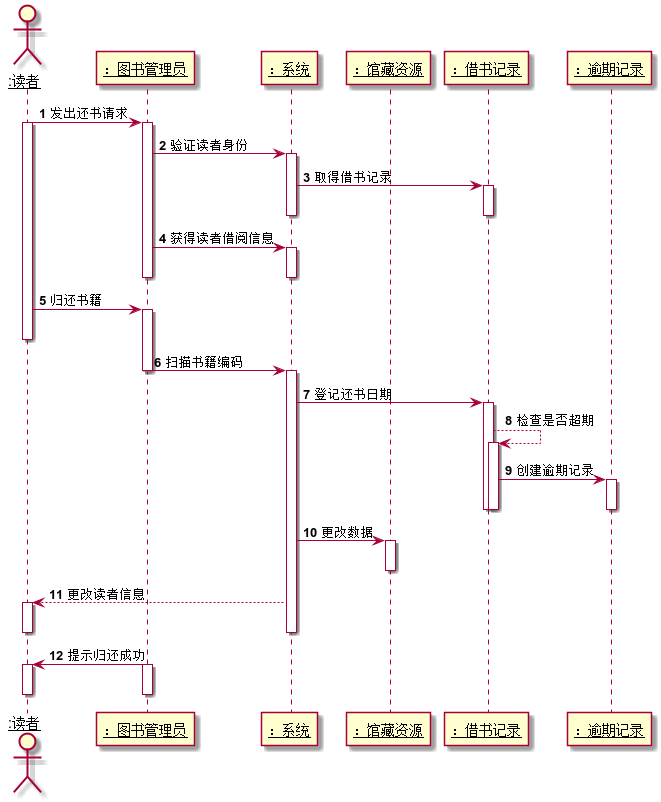

## 实验四：图书管理系统顺序图绘制

|学号|班级|姓名|
|:---------------:|:------------:|:------------:|
|201510414207|软件15-2|李金辉|

### 1.图书管理系统借出图书顺序图

**1.1PlantUML源码如下：**
~~~
@startuml
actor "<u:black>:图书管理员</u>" as Librarian
participant "<u:black>：读者</u>" as User
participant "<u:black>：系统</u>" as Sys
participant "<u:black>：馆藏资源</u>" as Collection
participant "<u:black>：借书记录</u>" as Record

autonumber 1
User --> Librarian :发出借书请求
activate User
deactivate User
activate Librarian
Librarian -> Sys: 验证身份
activate Sys
deactivate Sys
Librarian -> Sys: 获得读者信息
activate Sys
deactivate Sys
Librarian -> Sys:扫描书籍编码
deactivate Librarian
activate Sys
Sys ->Record: 创建借书记录
activate Record
Record -->Sys:创建成功
deactivate Record
Sys->Collection:  更改数据
activate Collection
deactivate Collection
Sys-->User: 更改读者借阅信息
activate User
deactivate User
deactivate Sys
Librarian->User:借阅成功
activate Librarian
deactivate Librarian
activate User
deactivate User
@enduml
~~~
**1.2借书用例顺序图如下：**

**1.3借书用例顺序图说明：** 
  读者首先发送借书请求给图书管理员，图书管理员验证读者身份后获得读者信息，
随后扫描书籍条码，系统自动创建借书记录，当创建成功后更改读者和馆藏信息，
同时图书管理员向读者显示借阅成功。

### 2.图书管理系统归还图书顺序图

**2.1PlantUML源码如下：**
~~~
@startuml
actor "<u:black>:读者</u>" as User
participant "<u:black>：图书管理员</u>" as Librarian
participant "<u:black>：系统</u>" as Sys
participant "<u:black>：馆藏资源</u>" as Collection
participant "<u:black>：借书记录</u>" as Record
participant "<u:black>：逾期记录</u>" as Overdue

autonumber 1
User -> Librarian :发出还书请求
activate User

activate Librarian
Librarian -> Sys: 验证读者身份
activate Sys
Sys->Record: 取得借书记录
activate Record
deactivate Record
deactivate Sys
Librarian -> Sys: 获得读者借阅信息
activate Sys
deactivate Sys
deactivate Librarian
User->Librarian: 归还书籍
activate Librarian
deactivate User
Librarian -> Sys:扫描书籍编码
deactivate Librarian
activate Sys
Sys ->Record: 登记还书日期
activate Record
Record-->Record: 检查是否超期
activate Record
Record ->Overdue: 创建逾期记录
activate Overdue
deactivate Overdue
deactivate Record
deactivate Record
Sys->Collection:  更改数据
activate Collection
deactivate Collection
Sys-->User: 更改读者信息
activate User
deactivate User
deactivate Sys
Librarian->User:提示归还成功
activate Librarian
deactivate Librarian
activate User
deactivate User
@enduml
~~~

**2.2归还图书顺序图如下：**

**2.3归还图书顺序图说明：** 
  读者首先发出还书请求，图书管理员验证读者身份后发送到系统取得借书记录，获取借阅
信息，当读者归还书籍时，图书管理员扫描书籍编码到系统，系统自动等级还书日期，并判断是否逾期，若逾期就创建逾期记录，随后系统自动更改读者和馆藏书籍，图书管理员提示读者还书成功。

