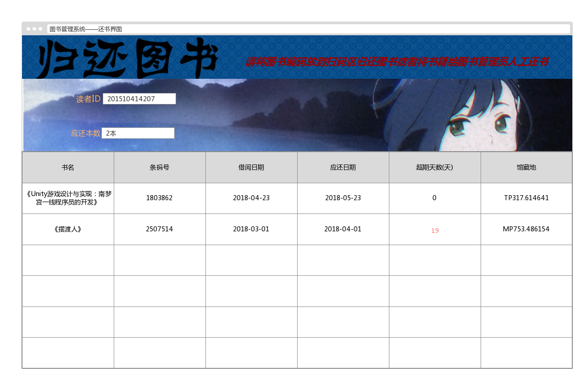

## 实验5 图书管理系统数据库设计与界面设计

|学号|班级|姓名|
|:---------------:|:------------:|:------------:|
|201510414207|软件15-2|李金辉|


## 1.数据库表设计
### 1.1 图书表：

|字段 |类型 |主键，外键 |可以为空 |默认值|约束|说明|
|:-------:|:-------------:|:------:|:----:|:---:|:----:|:-----|
|书籍ID|int|主键    |否| | | |
|书名|varchar(100)|否    |否| | | |
|国际书号|varchar(100)| 否  |否| | | |
|价格|varchar(100)|  否  |否|  |  |  |  
|出版社|varchar(100)| 否 |否| | | |
|出版日期|datetime|   否 |否| | | |
|作者|varchar(100)| 否  |是|  |  |  |  
|总数量|int| 否 |否| | | |
|借出数量|int|   否|是|  |  |  |  
|可借数量|int|   否|是|  |  |  | 

### 1.2 读者表：

|字段 |类型 |主键，外键 |可以为空 |默认值|约束|说明|
|:-------:|:-------------:|:------:|:----:|:---:|:----:|:-----|
|读者ID|int|主键    |否| | | |
|读者姓名|varchar(100)|     否   |否| | | |
|已借图书ID|int|  外键  |否|  |  |  |  

### 1.3 借阅表：

|字段 |类型 |主键，外键 |可以为空 |默认值|约束|说明|
|:-------:|:-------------:|:------:|:----:|:---:|:----:|:-----|
|借阅编号|int|主键    |否| | | |
|读者ID|int|外键   |否| | | |
|书籍ID|int|外键   |否| | | |
|借阅日期|datetime|否|否 | | |
|归还日期|datetime|否| 否| | |
|超期天数|int|否| 否| | |

### 1.4 借阅记录表：

|字段 |类型 |主键，外键 |可以为空 |默认值|约束|说明|
|:-------:|:-------------:|:------:|:----:|:---:|:----:|:-----|
|预约人ID|int|主键    |否| | | |
|预约日期|datetime|     否   |否| | | |
|预约书号|varchar(100)|  否 |否|  |  |  |  

### 1.5 超期记录表：

|字段 |类型 |主键，外键 |可以为空 |默认值|约束|说明|
|:-------:|:-------------:|:------:|:----:|:---:|:----:|:-----|
|读者ID|int|主键    |否| | | |
|书籍ID|int|     否   |否| | | |
|超期天数|int|  否 |否|  |  |  | 
|罚款金额|int|  否 |否|  |  |  | 

### 1.5 图书管理员表：

|字段 |类型 |主键，外键 |可以为空 |默认值|约束|说明|
|:-------:|:-------------:|:------:|:----:|:---:|:----:|:-----|
|管理员ID|int|主键    |否| | | |
|管理员姓名|int|     否   |否| | | |

### 1.6 系统管理员表：

|字段 |类型 |主键，外键 |可以为空 |默认值|约束|说明|
|:-------:|:-------------:|:------:|:----:|:---:|:----:|:-----|
|系统管理员ID|int|主键    |否| | | |
|系统管理员姓名|int|     否   |否| | | |


## 2. 界面设计
### 2.1. 还书界面设计

  

- 用例图参见：还书用例
- 类图参见：读者类,还书类
- 顺序图参见：还书顺序图
- API接口如下：  

1.查询读者API
- 功能：用于获取读者所有借阅信息
- 请求地址： http://localhost:8080/bookmanager/reader.jsp
- 请求方法：POST
- 请求参数：

|参数名称|必填|说明|
|:-------:|:-------------: | :----------:|
|读者ID|是|读者ID，信息的主键 |
|借阅日期|是|借走相应书籍ID的日期|
|应还日期|是|应当归还的日期|
|书籍ID|是|书籍ID|
|超期日期|是|读者超期天数|
|method|是|固定为 “post”。|


- 返回实例：
```
{
    "info": "读者信息",
    "data": {
        "readerID": "201510414207",
        "borrowdate": "2018-4-23",
        "returndate": "2018-5-23",
        "bookID": "66471247",
        "overdueDate": "0",
        },
    "code": 200
}
```
- 返回参数说明：
    
|参数名称|说明|
|:-------:|:-------------: |
|Info|返回信息|
|data|返回的读者信息|
|dodo|返回码|

2.归还图书API
- 功能：用于归还图书
- 请求地址： http://localhost:8080/bookmanager/returnbook.jsp
- 请求方法：POST
- 请求参数：

|参数名称|必填|说明|
|:-------:|:-------------: | :----------:|
|读者ID|是|读者表的主键 |
|书籍ID|是|书籍表的主键 |
|method|是|固定为 “post”。|

- 返回实例：
```
{
    "info": "归还成功",
    "data": {
        "result": "归还成功",
        },
    "code": 200
}
```
- 返回参数说明：
    
|参数名称|说明|
|:-------:|:-------------: |
|Info|返回信息|
|data|返回的结果信息|
|dodo|返回码|
